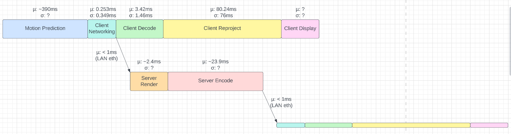
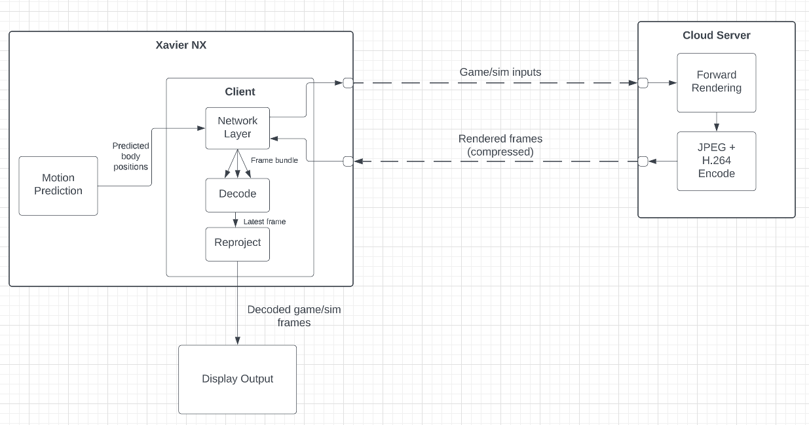

# Contents
- [Overview](https://github.com/CloudRenderVR/Manuals#the-big-picture)
- [Client](https://github.com/CloudRenderVR/Manuals#client)
- [Server](https://github.com/CloudRenderVR/Manuals#server)
- [Pose capture](https://github.com/CloudRenderVR/Manuals#pose-capture)
- [Pose prediction](https://github.com/CloudRenderVR/Manuals#pose-prediction)

# The big picture


Note that the pose prediction code is our least-developed area, and for now we're hoping to just bypass it (sending pose data from the capture directly to the client).

# Client

### The client is responsible for connecting to and establishing a video streaming connection (via H.264) with the server. Once a connection is made, it relays any input (such as pose data) to the server for rendering. When video frames are received, it first decodes, then reprojects, and finally displays on the local screen. The client software can be found [here](https://github.com/CloudRenderVR/Client).

## Overview

*High level overview of how the client works*


*Available scheduling choices for the client on the Xavier NX*,  **OUT OF DATE: We now have working HW and cpu-only decoding**


### Overview of control flow graph





## Installing

*While the client software should be able to run on other unix-based platforms, we have only tested on Xavier NX.*

First off, some necessary dependencies: `$ apt-get install ffmpeg libavcodec-dev libavformat-dev libswscale-dev libsfml-dev libopencv-dev`. This is the minimum required, and you'll need additional packages if you want, for example, software decoding. You'll also need to `$ git clone https://github.com/CloudRenderVR/Client` to get the actual repo.

## Configuring

There are various ways to change the behavior of the client, including the static scheduling choices. The primary way to alter the config is to edit `premake5.lua`. In this file, you'll see a `BUILD CONFIGURATION` section at the top, followed by a series of parameters that can be tweaked. All options are sufficiently commented in that file, so visit that for details. Note that you may need to run a clean build when tweaking these options, calling `make` by itself will not read changes from the build configuration. E.g: `$ rm -rf build && ./build.sh`

## Building

#### Note: you probably need sudo permissions to compile if you are configuring the build to make a custom FFmpeg build, since it needs to update linker paths!

Simply run the script `build.sh` which will make a build folder and compile for you (on Xavier NX or other ARM64 machines).

If you aren't compiling on ARM64, or want to build yourself, just run: `$ ./premake5[_x86] my_build_system`, where `my_build_system` is `gmake2` for unix-based systems. Note the two different executables, `premake5` and `premake5_x86`. The former is for ARM64 machines and the later for x86.

## Running

Build products are placed in the `build` folder when running the standard `build.sh` script. To run from your home directory, run the following command: `$ ./build/bin/client`. The client will then begin attempting to connect to the server, whose IP is hardcoded at [this line](https://github.com/CloudRenderVR/Client/blob/b198f1fc3c5cc28f036843bcec5d9fce12d696bb/CloudRenderVR/src/Main.cpp#L35).

Note: to kill the client, use Ctrl+C.

Note: dynamic linking requirements are as follows for hardware acceleration (opencv-cuda and ffmpeg-nvdec)
 > LD_LIBRARY_PATH=/usr/local/lib:/usr/lib/ffmpegNvidia2

## Profiling

We used two main forms of profiling for this project, Tracy and Nsight Systems. For Tracy profiling, make sure `Profiling = true` in the build script. After that, just run the client from the commandline and attach the server application. You can either compile the server yourself from the [tracy source code](https://github.com/wolfpld/tracy), just make sure the protocol versions line up. There is an existing compiled executable with the correct protocol on the Pikespeak machine, named `TracyServer.exe`, a shortcut to it is on the desktop.

For Nsight profiling, the following is a convience script to generate an Nsight trace:
```
nsys profile --accelerator-trace=nvmedia --trace=cuda,opengl,nvtx,nvmedia --process-scope=system-wide ./build/bin/client
```
Which can be ran from the client root directory. Running this creates either a `.qdrep` or `.nsys-rep` file, which you can then move over to the Pikespeak machine (or some other compute with Nsight Systems) via something like WinSCP. Opening this files on a Windows machine allows you to inspect the trace data. NOTE: there is a bug with Nsight Systems version 2022.3.3 where profiling the VIC accelerator will crash nsys when generating the report. To fix this, run profiling under `sudo` permissions.

### Which to use?

If you want to profile the actual time spend executing on the hardware (any non-cpu accelerator), use Nsight Systems. For any CPU profiling or latency measurements, Tracy is the preferred method.

### Tracy Guide

1. Launch the executable


2. Connect to the target


3. View the profiling data


For detailed usage, refer to the Tracy user [manual](https://github.com/wolfpld/tracy/releases/latest/download/tracy.pdf).
Basic guide:
Scroll by holding right click, mouse wheel to zoom. Left click on zones for information, then click Statistics for detailed info. Time range limits can be set using the Limits button to occlude outliers. Zones are specified in the code using `ZoneScopedN("zone name here");`, refer to the codebase for examples.

Note that launching the client executable with sudo permissions enables high detail profiling, where CPU samples are taken, all system threads recorded, and much more. However, the pikespeak machine has been getting booted off the LAN when doing this possibly due to ITS bandwidth limits? (High detail mode requires much more bandwidth).

### Networking bandwidth

When compiling with `Profiling = true`, a bandwidth report is generated after running. The file is called `netbandwidth.data`, and can be analyzed by running `python3 bandwidth.py`, which reports mean byte usage per frame. Note that you might want to run the server with maxfps=1 if you want to measure the bytes per frame, since doing this will ensure that at most one frame is pulled from the socket and decoded every time the client updates, and frames are not batched.

# Server

The server code lives [here](https://github.com/CloudRenderVR/Server). We just provide our custom `PixelStreaming` module, instead of a full Unreal Engine source build. To build the server, see the readme in the server repo. Note I believe we used unreal engine [4.26](https://github.com/EpicGames/UnrealEngine/tree/4.26).

To get the server running, just create a new Unreal Engine project (we used the fps template), and make sure to enable the `Pixel Streaming` plugin in the project. After that, you should be able to simply package your project and run it, which will automatically start up our streaming system, provided you gave the proper commandline arguments (see server repo readme for details). The server provides various logs to the console for debugging connections and streaming.

The pre-built basic project (fps template) executable is located here on the server:


There are a collection of various shortcuts to the exe, all with varying commandline arguments. The highlighted one has fairly default settings.

**NOTE:** the client hardware decoder for some reason cannot recover from an interrupted H.264 stream. This means that if you connect the client to server and render some frames, then kill the client and restart only the client, then the client will fail to decode all server frames (if hardware accelerated). The software decoder can recover properly once a sync frame is sent over. To fix this, just restart the server executable every time you restart the client.

## Profiling

To measure time spent on the server, there's two figures to look at: rendering time and encoding time.

To measure rendering time, run without `-RenderOffScreen` so local display is enabled. Then, hit the tilde key to open the console and type `stat fps`. This will show the rendering time in the top right corner.


For measuring encoding time, refer to the console that opens when running. When the client is connected, you should see entries in the console similar to the following:

 > [2023.04.27-21.47.12:185][ 81]PixelStreaming: Encode factory latency: 23.914 ms

These messages show the CPU latency spent encoding a single frame.

# Pose capture

Pose capture uses the intel realsense depth camera to isolate a BODY25 skeleton of the human in frame. Detailed information on calibrating the camera is located in the [PoseExtracton_DepthCamera repo README](https://github.com/CloudRenderVR/PoseExtraction_DepthCamera/blob/master/README.md).

*Important setup notes:*

1. For some reason, running `main.py` from powershell did not function for me initially, throwing memory shape errors in OpenCV internals, to fix this, I ran the code from VSCode (made a launch.json and ran as a python file).
2. To get the model data, go to the root directory of the pose repo, and run `git clone https://github.com/CMU-Perceptual-Computing-Lab/openpose`. Then, navigate to `openpose/models` and run `getModels.bat` or `getModels.sh`.
3. In addition to a cuda-enabled OpenCV build (tested 4.5.5), you'll need zlib. Linux is a standard build via cmake, but on Windows I had to rename the dll. Steps for getting zlib on windows:
    1. Download `https://zlib.net/zlib1212.zip`, or get a more recent version if available from `zlib.net`.
    2. Open cmake-gui, pointing to the folder that contains the CMakeLists.txt file (the root directory of zlib). Make a folder called "build" in this folder and set that build directory to be the build output directory in cmake-gui.
    3. Configure and Generate.
    4. Open the solution files and either build all or just build `zlib` and `install`.
    5. Copy `zlib.dll` from the bin directory either into your system path or just right next to `main.py`.
    6. Rename `zlib.dll` to `zlibwapi.dll`.

# Pose reprojection

Pose reprojection takes the BODY25 skeleton and reprojects it to a H99 skeleton. The file responsible for this transition is located in the human motion prediction distro, specifically under the PythonVersionSafety branch. This is required because the model only accepts H99 poses. 

# Pose prediction

Pose Prediction is done statistically using a seq2seq model (takes a sequence and outputs a sequence). This model has been edited to focus on the eye movement, which isn't specifically recorded in the skeleton pose.
Note that we use a virtual environment (located `/home/andrewdepke/motionPrediction/.venv` on the Xavier NX device), which can be activated with `$ source .venv/bin/activate`. Then motion prediction can be run with `$ python3 src/continuous_prediction.py`.
